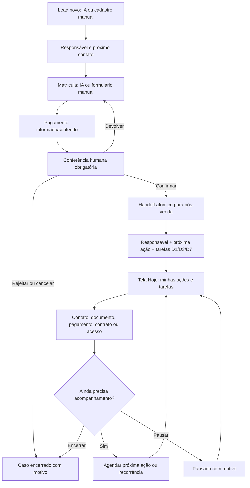

# Fluxo operacional manual e assistido por IA

Este documento define como o EDU.IA mantém matrículas novas e alunos antigos em acompanhamento contínuo. A IA pode sugerir, preencher e automatizar ações, mas toda etapa operacional também possui um caminho manual e auditável.

## Princípio central

Uma matrícula nova não substitui nem esconde os acompanhamentos anteriores. Todo aluno confirmado permanece no pós-venda enquanto o ciclo estiver `ATIVO` ou `PAUSADO`. Encerrar um caso exige uma ação humana e um motivo.

Cada caso ativo deve ter:

- um responsável real (`assigneeId`);
- uma próxima ação com data (`nextActionAt`);
- ao menos uma tarefa aberta;
- histórico de contatos e mudanças operacionais.

Se algum desses vínculos faltar, a reconciliação diária repara o caso e o coloca novamente na fila de trabalho.

## Gestão da equipe

A tela `/team` é exclusiva de administradores da escola. Nela é possível cadastrar funcionários, editar nome, email e perfil, redefinir senha, desativar ou reativar acessos.

Os perfis disponíveis são:

- `Administrador`: acesso completo à operação, configurações e gestão da equipe;
- `Atendente`: acesso ao atendimento, contatos e execução do próprio trabalho, sem gestão de usuários ou configurações da escola.

Não é permitido desativar o próprio usuário nem remover o último administrador ativo. Quando um funcionário possui leads, matrículas, casos ou tarefas abertas, a desativação exige escolher outro funcionário ativo; a redistribuição e o bloqueio de acesso acontecem na mesma operação. Alterar perfil, redefinir senha ou desativar o usuário encerra as sessões anteriores quando necessário.

## Fluxo diário

## Operação manual por área

| Área | Ações humanas disponíveis | Papel da IA/automação |
|---|---|---|
| Leads | Criar, editar, atribuir, mudar etapa e registrar contato | Qualificar e preencher dados sugeridos |
| Matrícula | Criar/editar formulário, conferir pagamento, devolver, rejeitar, cancelar, reabrir e confirmar | Coletar dados e preparar a matrícula |
| Documentos | Enviar, aprovar ou rejeitar com observação | Organizar checklist e apontar pendências |
| Pós-venda | Definir responsável, próxima ação, pausar ou encerrar com motivo | Criar handoff e sinalizar riscos |
| Pagamento/contrato | Atualizar situação real e registrar observação | Exibir pendências e sugerir sequência |
| Tarefas | Criar, editar, reagendar, atribuir, concluir, cancelar, reabrir e tornar recorrente | Criar tarefas de regra e escalar atrasos |
| Contatos | Registrar canal, resultado, nota e próximo retorno | Trazer o retorno para a tela Hoje |

## Handoff da matrícula

Pagamento aprovado significa `AGUARDANDO_CONFERENCIA`, nunca confirmação automática. Quando o humano confirma, uma única transação:

1. muda a matrícula para `CONFIRMADA` e registra quem confirmou;
2. cria ou atualiza o caso ativo com responsável e próxima ação;
3. cria tarefas iniciais de documentos, pagamento/contrato, primeiro acesso e adaptação;
4. registra o evento de handoff na linha do tempo.

Se a transação falhar, nenhuma parte fica confirmada isoladamente.

## Tela Hoje

A tela `/hoje` é a fila operacional principal. O modo “Minhas” filtra matrícula, lead, tarefa, contato e caso pelo usuário atribuído. O modo “Todas” também mostra casos sem responsável para distribuição.

A ordem de trabalho recomendada é:

1. itens atrasados;
2. matrículas esperando conferência;
3. casos ativos com próxima ação vencida ou para hoje;
4. contatos agendados;
5. tarefas do dia;
6. leads novos sem primeiro contato há mais de 24 horas.

Ao concluir uma ação, o operador deve registrar o resultado e programar o próximo passo. Uma tarefa recorrente gera a ocorrência seguinte somente quando a atual é concluída; registrar um contato não encerra recorrências manuais.

## Reconciliação e segurança

A Vercel chama diariamente `GET /internal/automation/run`. O endpoint só aceita `Authorization: Bearer <CRON_SECRET>` e percorre todas as escolas ativas.

A rotina:

- recupera alunos confirmados sem estado, responsável ou próxima ação;
- cria uma tarefa de continuidade quando o caso não possui tarefa aberta;
- eleva para `Urgente` tarefas vencidas há mais de 48 horas;
- sincroniza as tarefas automáticas usando somente matrículas reais confirmadas.

Dados de demonstração ficam desativados por padrão e só aparecem quando o usuário liga explicitamente o modo demo. As consultas reais não possuem limite fixo de 12 alunos; o perfil de um aluno histórico é buscado diretamente pelo identificador e pela escola.

## Estados operacionais

- `ATIVO`: exige responsável e próxima ação.
- `PAUSADO`: exige motivo; não exige data enquanto estiver pausado.
- `ENCERRADO`: exige motivo e remove o caso da fila operacional ativa.

Cancelar uma matrícula encerra o caso e cancela suas tarefas abertas. Reabrir uma matrícula cancelada ou rejeitada devolve a matrícula à conferência humana; ela só volta ao pós-venda depois de nova confirmação.
